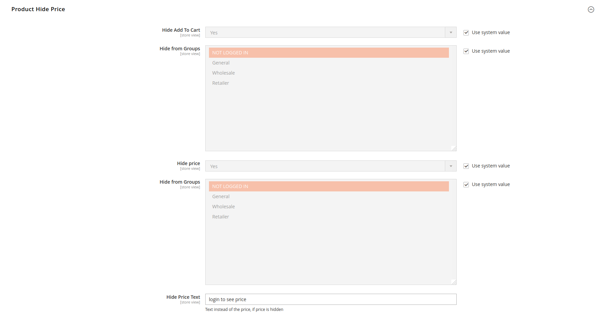

# Magento2 Hide Price

Extension allows to hide the product price and the add to cart button from selectable customer groups.
This extension is a merging of the vishwassoni/m2-hide-price and dsasmita/magento2-hide-price-not-login 

### Configuration



## Install with Composer

1. Go to Magento2 root folder

2. Enter following commands to install module:

    ```bash
    composer config repositories.hideprices git https://github.com/template-provider/m2-hide-price.git
    composer require template-provider/m2-hide-price:dev-master
    ```

3. Enter following commands to enable module:

    ```bash
   php bin/magento setup:upgrade
   ```
   
4. Config the Hide Price under Stores > Configuration > Catalog > Product Hide Price
